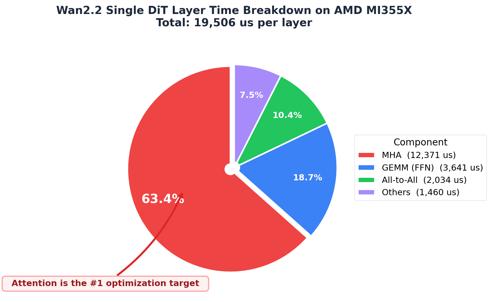
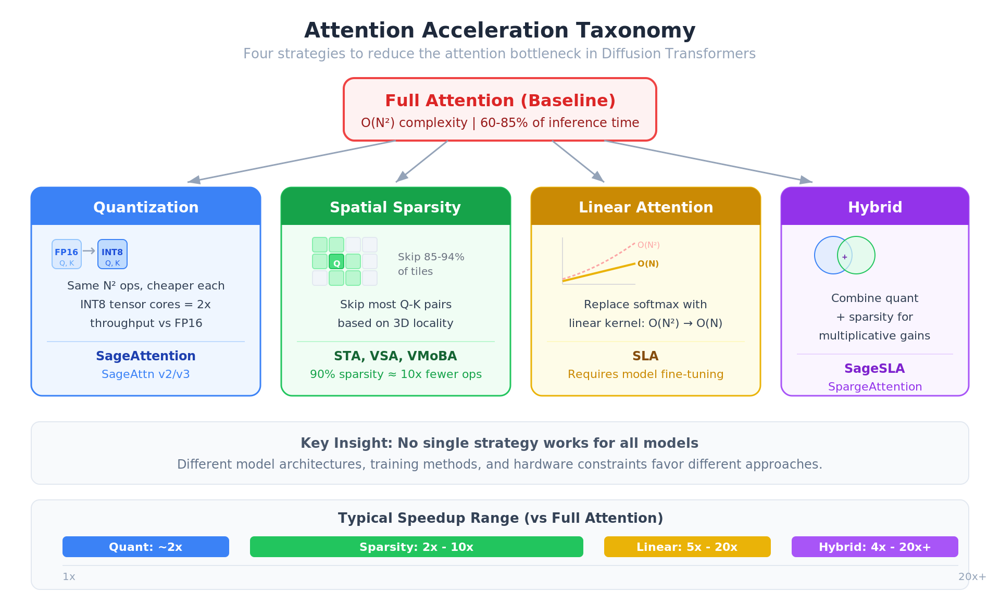
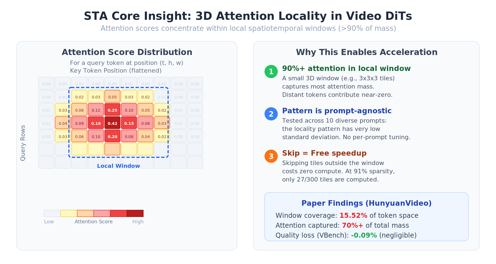
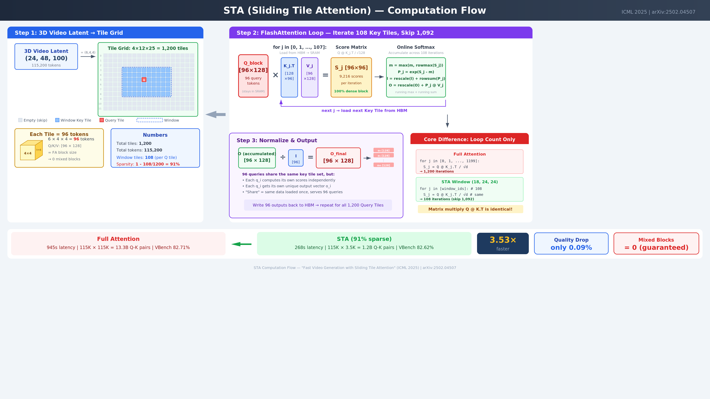
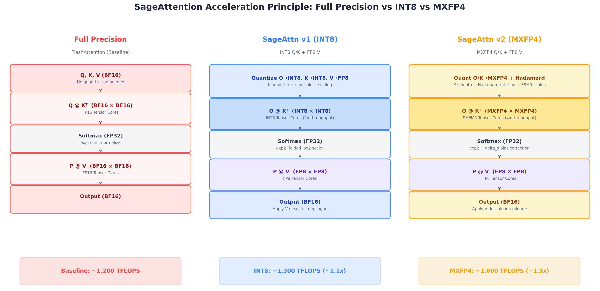
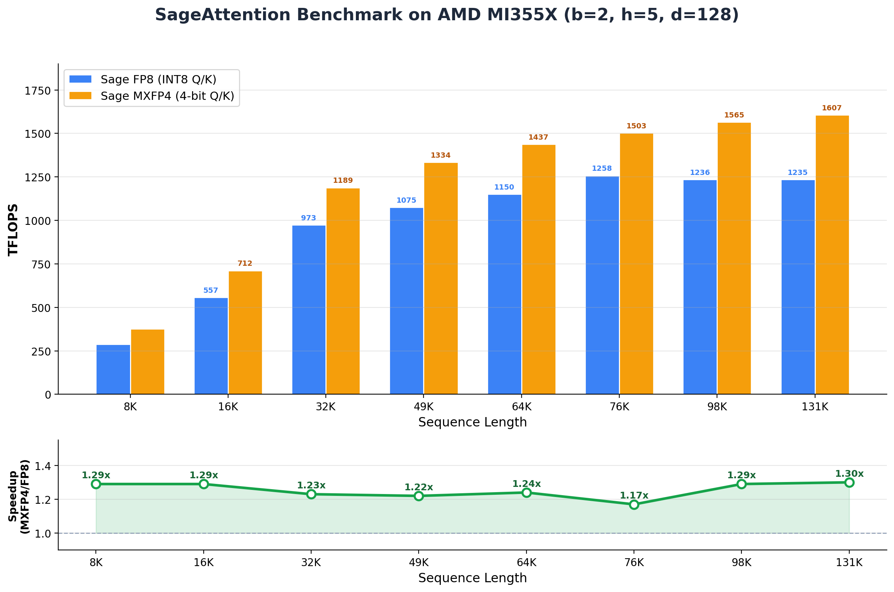

# Attention Variants in Multimodal Diffusion Models: Acceleration Principles and Hardware Implications

> **Version**: v1.1 | **Date**: 2026-03-03
> **Purpose**: Survey attention acceleration techniques in video/image diffusion models; inform custom operator development planning

---

## Table of Contents

1. [Background: Full Attention Performance Bottleneck](#1-background-full-attention-performance-bottleneck)
2. [Attention Variant Taxonomy & SGLang Support Status](#2-attention-variant-taxonomy--sglang-support-status)
3. [Deep Dive: Sliding Tile Attention (STA)](#3-deep-dive-sliding-tile-attention-sta)
4. [Deep Dive: SageAttention](#4-deep-dive-sageattention)
5. [Deep Dive: SegAttention](#5-deep-dive-segattention) *(TBD)*
6. [Future Analysis](#6-future-analysis) *(TBD)*

---

## 1. Background: Full Attention Performance Bottleneck

### 1.1 Why Attention Matters in Diffusion Transformers

Modern video generation models (HunyuanVideo, Wan2.x, CogVideoX) use **Diffusion Transformers (DiT)** as their backbone. Unlike image models, video DiTs process extremely long sequences — a 5-second 720P video produces **115,200 tokens** in the latent space. Since standard attention has **O(N²)** complexity, the cost grows quadratically with sequence length and becomes the dominant bottleneck. At 115K tokens, each attention layer computes **13.3 billion Q-K pairs**.

### 1.2 Measured Data: Wan2.2 Single-Layer Profiling on AMD MI355X

We profiled a single DiT layer of the **Wan2.2** model on **AMD MI355X**. The results clearly show that Multi-Head Attention (MHA) dominates the computation:

| Component   | Time (us) | Percentage |
|:------------|----------:|-----------:|
| All-to-All  |     2,034 |     10.43% |
| **MHA**     | **12,371**| **63.42%** |
| GEMM (FFN)  |     3,641 |     18.67% |
| Others      |     1,460 |      7.48% |
| **Total**   | **19,506**| **100.00%**|

**Conclusion**: MHA accounts for **63%** of single-layer time. With 30+ transformer layers in a typical DiT, attention is by far the largest optimization target.

### 1.3 Published Profiling Data from Research Papers

Multiple independent papers confirm that attention is the dominant bottleneck:

| Source | Model | Hardware | Attention Time | Metric |
|:-------|:------|:---------|:--------------:|:-------|
| **STA** (arXiv:2502.04507) | HunyuanVideo (5s 720P) | H100 | **84.7%** (800/945s) | Wall-clock |
| **Sparse VideoGen** (arXiv:2502.01776) | HunyuanVideo (5s) | A100 | **>80%** | Wall-clock |
| **Analysis of Attention in VDiTs** (arXiv:2504.10317) | Mochi-1 (10B) | — | **~60%** | FLOPS proportion |
| **Our measurement** | Wan2.2 | MI355X | **63.42%** | Wall-clock (single layer) |

> **Note**: The STA paper reports that generating a 5-second 720P video with HunyuanVideo takes **945 seconds** on a single H100, of which **800 seconds** are spent on attention alone. The Mochi-1 model shows a lower attention percentage (~60%) because it uses an Asymmetric DiT architecture with relatively larger FFN layers.

### 1.4 Key Takeaway

Across different models and hardware platforms, **attention consistently accounts for 60–85% of inference time** in video DiT models. This makes attention the single most impactful optimization target. Any reduction in attention computation — through sparsity, quantization, or algorithmic reformulation — translates almost directly to end-to-end speedup.

---

## 2. Attention Variant Taxonomy & SGLang Support Status

### 2.1 Attention Acceleration Approaches

Full attention computes **all** N² query-key interactions, but in video diffusion models, most of these interactions contribute negligibly to the output. Different acceleration strategies exploit this redundancy in different ways. We categorize the attention variants in SGLang into **four families**:

#### Category 1: Quantization-Based

**Representative**: SageAttention (v1/v2/v3)

- **How it accelerates**: Quantize Q and K to INT8 before computing Q@K^T. The score matrix computation uses INT8 tensor cores (2x throughput vs FP16). P@V remains in FP16 for accuracy.
- **Speedup**: ~2x over FlashAttention with negligible quality loss
- **Trade-off**: Same number of operations, but each operation is cheaper

#### Category 2: Spatial Sparsity

**Representatives**: STA, VSA, VMoBA

- **How it accelerates**: Identify which Q-K pairs are important (based on spatial locality, learned patterns, or dynamic selection), and skip the rest entirely.
- **Speedup**: Proportional to sparsity — 90% sparsity ≈ ~10x fewer operations
- **Trade-off**: Some attention information is discarded; requires careful window/mask design

#### Category 3: Linear Attention

**Representative**: SLA (Sparse Linear Attention)

- **How it accelerates**: Replace the softmax attention mechanism with a linear kernel function, reducing complexity from O(N²) to O(N). This fundamentally changes the computation rather than optimizing it.
- **Speedup**: Theoretically unbounded as N grows; in practice 5-20x on long sequences
- **Trade-off**: Requires model fine-tuning; may affect generation quality

#### Category 4: Hybrid Approaches

**Representatives**: SageSLA, SpargeAttention

- **How it accelerates**: Combine techniques from multiple categories. For example, SageSLA combines SageAttention's quantization with SLA's linear formulation; SpargeAttention combines SageAttention with spatial sparsity.
- **Speedup**: Multiplicative gains from combining techniques
- **Trade-off**: More complex implementation; cumulative accuracy impact

### 2.2 SGLang Compatibility Matrix

The table below shows which attention optimizations are supported for each model in **SGLang's diffusion pipeline**:

| Model Name | Model ID | TeaCache | Sliding Tile Attn | Sage Attn | VSA | SLA | SageSLA | SVG2 |
|:---|:---|:---:|:---:|:---:|:---:|:---:|:---:|:---:|
| FastWan2.1 T2V 1.3B | `FastVideo/FastWan2.1-T2V-1.3B-Diffusers` | — | — | — | ✅ | ❌ | ❌ | ❌ |
| FastWan2.2 TI2V 5B Full Attn | `FastVideo/FastWan2.2-TI2V-5B-FullAttn-Diffusers` | — | — | — | ✅ | ❌ | ❌ | ❌ |
| Wan2.2 TI2V 5B | `Wan-AI/Wan2.2-TI2V-5B-Diffusers` | — | — | ✅ | — | ❌ | ❌ | ❌ |
| Wan2.2 T2V A14B | `Wan-AI/Wan2.2-T2V-A14B-Diffusers` | ❌ | ❌ | ✅ | — | ❌ | ❌ | ❌ |
| Wan2.2 I2V A14B | `Wan-AI/Wan2.2-I2V-A14B-Diffusers` | ❌ | ❌ | ✅ | — | ❌ | ❌ | ❌ |
| HunyuanVideo | `hunyuanvideo-community/HunyuanVideo` | ❌ | ✅ | ✅ | — | ❌ | ❌ | ✅ |
| FastHunyuan | `FastVideo/FastHunyuan-diffusers` | ❌ | ✅ | ✅ | — | ❌ | ❌ | ✅ |
| Wan2.1 T2V 1.3B | `Wan-AI/Wan2.1-T2V-1.3B-Diffusers` | ✅ | ✅ | ✅ | — | ❌ | ❌ | ✅ |
| Wan2.1 T2V 14B | `Wan-AI/Wan2.1-T2V-14B-Diffusers` | ✅ | ✅ | ✅ | — | ❌ | ❌ | ✅ |
| Wan2.1 I2V 480P | `Wan-AI/Wan2.1-I2V-14B-480P-Diffusers` | ✅ | ✅ | ✅ | — | ❌ | ❌ | ✅ |
| Wan2.1 I2V 720P | `Wan-AI/Wan2.1-I2V-14B-720P-Diffusers` | ✅ | ✅ | ✅ | — | ❌ | ❌ | ✅ |
| TurboWan2.1 T2V 1.3B | `IPostYellow/TurboWan2.1-T2V-1.3B-Diffusers` | ✅ | ❌ | ❌ | ❌ | ✅ | ✅ | — |
| TurboWan2.1 T2V 14B | `IPostYellow/TurboWan2.1-T2V-14B-Diffusers` | ✅ | ❌ | ❌ | ❌ | ✅ | ✅ | — |
| TurboWan2.1 T2V 14B 720P | `IPostYellow/TurboWan2.1-T2V-14B-720P-Diffusers` | ✅ | ❌ | ❌ | ❌ | ✅ | ✅ | — |
| TurboWan2.2 I2V A14B | `IPostYellow/TurboWan2.2-I2V-A14B-Diffusers` | ✅ | ❌ | ❌ | ❌ | ✅ | ✅ | — |

> Source: SGLang Diffusion `docs/diffusion/compatibility_matrix.md`

### 2.3 Key Observation

The compatibility matrix reveals an important pattern: **no single acceleration technique works for all models**. This is because:

1. **Model architecture differences** — Some models (Wan2.2 A14B) use attention patterns incompatible with STA's tiling
2. **Training requirements** — Linear attention (SLA) requires specialized distilled models (TurboWan series)
3. **Hardware constraints** — STA's CUDA kernel requires Hopper GPUs; the Triton kernel is cross-platform

This diversity reinforces the need for hardware-level support of multiple attention paradigms, not just one.

---

## 3. Deep Dive: Sliding Tile Attention (STA)

> **Paper**: "Fast Video Generation with Sliding Tile Attention" (Zhang et al., 2025, arXiv:2502.04507)
> **Code**: [hao-ai-lab/FastVideo](https://github.com/hao-ai-lab/FastVideo)

### 3.1 Core Insight: Why STA Can Accelerate Attention

STA is built on a single fundamental observation: **in video diffusion models, attention scores concentrate locally in 3D space**. A small local window covering only ~15% of the total token space captures >70% of attention mass (Paper Figure 2-3, tested across 10 diverse prompts, the pattern is prompt-agnostic).

This means we can **skip computing attention for distant tokens** with minimal quality loss. The question is: **how to skip efficiently on GPU hardware?**

### 3.2 The Problem with Naive Sliding Window Attention

A naive approach (like NATTEN/CLEAR) applies a sliding window at the **token level** — each token has its own window center. But FlashAttention computes at the **block level** (groups of tokens). This mismatch creates three types of blocks:

| Block Type | Description | GPU Efficiency |
|:-----------|:------------|:---------------|
| **Dense** | All scores retained | Efficient — full utilization |
| **Empty** | All scores masked | Free — skipped entirely |
| **Mixed** | Partially masked | **INEFFICIENT** — same FLOPs as dense + mask overhead |

At 90% sparsity, NATTEN/CLEAR produce many mixed blocks, resulting in **0.86x** speed (actually **slower** than full attention!). STA's tile-level design guarantees **zero mixed blocks**, achieving **10.45x** speedup at the same sparsity level.

**STA's solution**: Group tokens into **tiles** first, then apply the sliding window at the **tile level**. All tokens in the same tile share the same window center, so every block is either fully inside (dense) or fully outside (empty).

### 3.3 STA Computation Flow

The following diagram illustrates the complete STA computation pipeline using HunyuanVideo 720P 5s as a concrete example:

The pipeline consists of four steps:

**Step 1: 3D Video Latent → Tile Grid** — The 3D video latent (30×48×80 = 115,200 tokens) is partitioned into tiles of size 6×8×8 = 384 tokens each, producing a 5×6×10 = 300 tile grid. Tokens within the same tile are rearranged to have consecutive IDs (via einops), so each tile maps exactly to one FlashAttention block — guaranteeing zero mixed blocks.

**Step 2: Determine Window Key Tiles** — For each Query Tile, the 3D sliding window determines which Key Tiles to attend to. With window (3,3,3) tiles, each query attends to only 27 out of 300 tiles (91% sparsity). The remaining 273 tiles are skipped entirely at zero cost.

**Step 3: FlashAttention Loop** — The Q block [384×128] is loaded into SRAM and stays for all iterations. The kernel loops over only the 27 window Key Tiles (instead of 300), loading K_j and V_j from HBM, computing scores S_j = Q @ K_j.T / √d, applying online softmax, and accumulating the output. Every block is 100% dense — no masking overhead.

**Step 4: Normalize & Output** — After the loop, O_final = O / l produces 384 output vectors. These are written back to HBM, and the process repeats for all 300 Query Tiles.

**The core difference from full attention is purely the loop count**: full attention iterates 300 times, STA iterates 27 times. The per-iteration matmul is identical. STA's speedup comes entirely from reducing the number of iterations.

### 3.4 Paper Benchmark Data

#### Speedup Comparison (from STA paper)

| Method | Sparsity | VBench Total | Quality | Speedup | Notes |
|:-------|:--------:|:------------:|:-------:|:-------:|:------|
| HunyuanVideo (FA3) | 0% | 82.71% | 85.34% | 1.0x | Baseline |
| STA training-free | — | 82.46% | 84.63% | 1.79x | No fine-tuning needed |
| **STA finetuned** | — | **83.00%** | **85.37%** | **2.44x** | Improves quality! |
| **STA finetuned** | ~91% | **82.62%** | **84.76%** | **3.53x** | Only -0.09% VBench |

> Key result: At 91% sparsity, STA achieves **3.53x end-to-end speedup** with only 0.09% quality degradation. Competing methods (CLEAR, NATTEN) are actually **slower than full attention** at the same sparsity level due to mixed block overhead.

#### Quality Preservation (Human Evaluation, Paper Data)

In human evaluation on MovieGen Bench (200 prompts), evaluators could not distinguish STA output from the original HunyuanVideo in **83%** of cases (STA Win 6.5%, Tie 83.0%, Original Win 10.5%).

### 3.5 Measured Benchmark Data: H100 (Hopper)

#### Test Environment

| Item | Detail |
|:-----|:-------|
| **GPU** | NVIDIA H100 80GB HBM3 (Hopper, SM 9.0, 132 SMs) |
| **Memory** | 79.18 GB HBM3 |
| **CUDA** | 12.9 |
| **Precision** | BF16 |
| **Backends** | STA CUDA (st_attn v0.0.7), FA3 (sgl-kernel), SDPA |

> **Note**: H100 is SM 9.0 with 132 SMs — the reference platform from the STA paper. The STA CUDA kernel full-window produces correct output (cos ~1.0). However, with the publicly released st_attn v0.0.7, **all sparse windows produce invalid micro-benchmark output** on this H100 setup. The STA paper reports results using an internal/newer kernel version. FA3 works as the paper's primary baseline.

#### Micro-Benchmark: Latency & TFLOPS (H100)

##### HunyuanVideo 5s 720P — `30x48x80` (115,456 tokens, Dense = 163.80 TFLOP)

| Method | Window | Latency (ms) | vs SDPA | vs FA3 | TFLOPS |
|:-------|:-------|:------------:|:-------:|:------:|:------:|
| **SDPA** (baseline) | full | 270.57 | 1.00x | 1.28x | **605** |
| **FA3** (paper baseline) | full | 347.67 | 0.78x | 1.00x | **471** |
| **STA CUDA full** | (5,6,10) | 326.05 | 0.83x | 1.07x | **502** |
| **STA CUDA sparse** | (3,3,3) | 37.98* | 7.12x | 9.15x | — |

##### StepVideo — `36x48x48` (82,944 tokens, Dense = 84.54 TFLOP)

| Method | Window | Latency (ms) | vs SDPA | vs FA3 | TFLOPS |
|:-------|:-------|:------------:|:-------:|:------:|:------:|
| **SDPA** (baseline) | full | 141.25 | 1.00x | 1.29x | **598** |
| **FA3** (paper baseline) | full | 182.47 | 0.77x | 1.00x | **463** |
| **STA CUDA full** | (6,6,6) | 162.06 | 0.87x | 1.13x | **522** |

##### Wan 5s 480P — `18x48x80` (69,120 tokens, Dense = 58.71 TFLOP)

| Method | Window | Latency (ms) | vs SDPA | vs FA3 | TFLOPS |
|:-------|:-------|:------------:|:-------:|:------:|:------:|
| **SDPA** (baseline) | full | 98.14 | 1.00x | 1.29x | **598** |
| **FA3** (paper baseline) | full | 126.89 | 0.77x | 1.00x | **463** |
| **STA CUDA full** | (3,6,10) | 107.41 | 0.91x | 1.18x | **547** |

> *Sparse window latency is measured but output is **invalid** (cos=0.30) with st_attn v0.0.7. The STA paper's internal kernel reports 25.38ms / 10.45x vs FA3 at 91% sparsity on H100.

#### End-to-End: FastHunyuan on H100

Despite micro-benchmark correctness concerns, the end-to-end FastHunyuan pipeline with STA sparse produces successful video output:

| Metric | FA3 Baseline | SDPA Baseline | STA CUDA Sparse | vs FA3 | vs SDPA |
|:-------|:------------:|:-------------:|:---------------:|:------:|:-------:|
| **Denoising time** | 77.68s | 77.42s | **46.28s** | **1.68x** | **1.67x** |
| Avg step time | 12.95s/step | 12.90s/step | 7.71s/step | 1.68x | 1.67x |
| End-to-end | 104.17s | 104.23s | **67.10s** | **1.55x** | **1.55x** |

> **Setup**: 2× H100 80GB, FastHunyuan-diffusers (12.82B params), Ulysses SP degree=2, 6 inference steps. STA config: steps 0-1 full window [5,6,10], steps 2-5 sparse [3,3,3] (91% sparsity).

#### H100 Key Findings

1. **FA3 achieves ~463–471 TFLOPS on H100 (0.77x SDPA)** — notably slower than SDPA, likely due to varlen interface overhead. The STA paper uses FA3 as the baseline, so STA speedups should be compared against FA3.

2. **End-to-end STA sparse delivers 1.68x denoising speedup** — the FastHunyuan pipeline with STA sparse (steps 0-1 full, steps 2-5 sparse at 91% sparsity) achieves 46.28s vs 77.68s FA3 baseline.

3. **STA paper reports 10.45x kernel-level speedup on H100** — the publicly released st_attn v0.0.7 does not reproduce sparse micro-benchmark results, suggesting the paper used an internal kernel version.

---

## 4. Deep Dive: SageAttention

> **Papers**: SageAttention v1 ([arXiv:2410.02367](https://arxiv.org/abs/2410.02367), ICLR 2025), SageAttention v2 ([arXiv:2411.10958](https://arxiv.org/abs/2411.10958), ICML 2025)
> **Code**: [thu-ml/SageAttention](https://github.com/thu-ml/SageAttention), AMD implementation in [ROCm/aiter](https://github.com/ROCm/aiter)

### 4.1 Acceleration Principle

Unlike STA (which **skips** computations via sparsity), SageAttention makes **each computation cheaper** by quantizing Q, K, V to low-precision formats before computing attention. The algorithm structure is unchanged — still FlashAttention-style tiled attention with online softmax — but the matrix multiplies use higher-throughput low-precision tensor cores.

SageAttention has two variants, each targeting a different precision–throughput trade-off:

| Variant | Q/K Format | V Format | QK Tensor Core | Throughput vs BF16 |
|:--------|:-----------|:---------|:---------------|:-------------------|
| **SageAttn v1** | INT8 | FP8 (e4m3fn) | INT8 MFMA (2x) | ~1.1x |
| **SageAttn v2 MXFP4** | MXFP4 (e2m1) | FP8 (e4m3fn) | SMFMA (4x) | ~1.3x |

The computation pipeline has two phases:

**Phase 1: Quantization** — Convert BF16 inputs to low-precision with accuracy-preserving techniques:
- **K Smoothing**: Subtract per-head mean from K along the sequence dimension, centering values around zero to reduce dynamic range
- **Hadamard Rotation** (MXFP4 only): Apply orthogonal rotation to spread outlier values across all dimensions, preventing a single large dimension from dominating the 4-bit quantization scale
- **Scale folding**: The softmax scale factor (1/√d) and log2(e) constant are folded into Q's quantization scale, enabling faster `exp2` instead of `exp` in the attention kernel

**Phase 2: Attention** — FlashAttention loop using low-precision tensor cores for both Q@K^T (INT8 or MXFP4) and P@V (FP8), with online softmax in FP32.

The following diagram compares the three approaches side-by-side:

**Why the speedup is moderate (~1.1–1.3x) rather than 2–4x**: The theoretical tensor core throughput gain is 2x (INT8) or 4x (MXFP4), but attention is **memory-bandwidth bound** at long sequences — the bottleneck shifts from compute to data movement. The quantization itself also adds overhead (additional kernel launch + memory for scale factors). Nevertheless, on compute-bound configurations (large batch, many heads), SageAttention delivers meaningful speedup with negligible quality loss.

### 4.2 Measured Benchmark Data: AMD MI355X

We benchmarked both SageAttention variants on **AMD MI355X** (gfx950) using the [AITer](https://github.com/ROCm/aiter) Triton implementation. The MXFP4 variant uses the MI355X-specific **SMFMA** (Scaled Matrix Fused Multiply-Add) instructions.

#### Sequence Length Scaling (b=2, h=5, d=128)

| Sequence Length | Sage FP8 Time | Sage FP8 TFLOPS | MXFP4 Time | MXFP4 TFLOPS | Speedup |
|:---------------:|:-------------:|:---------------:|:----------:|:------------:|:-------:|
| 8K | 1.18 ms | 288 | 0.91 ms | 376 | 1.29x |
| 16K | 2.45 ms | 557 | 1.91 ms | 712 | 1.29x |
| 32K | 5.68 ms | 973 | 4.63 ms | 1,189 | 1.23x |
| 49K | 11.57 ms | 1,075 | 9.47 ms | 1,334 | 1.22x |
| 64K | 19.16 ms | 1,150 | 15.45 ms | 1,437 | 1.24x |
| 76K | 23.41 ms | 1,258 | 20.06 ms | 1,503 | 1.17x |
| 98K | 41.47 ms | 1,236 | 32.03 ms | 1,565 | 1.29x |
| 131K | 71.28 ms | 1,235 | 54.64 ms | 1,607 | 1.30x |

#### Ultra-Long Sequences (b=1, h=1, d=128)

| Sequence Length | Sage FP8 TFLOPS | MXFP4 TFLOPS | Speedup |
|:---------------:|:---------------:|:------------:|:-------:|
| 131K | 1,115 | 1,486 | 1.20x |
| 196K | 1,068 | 1,474 | 1.45x |
| 262K | 1,291 | 1,701 | 1.43x |

> At 262K tokens, MXFP4 achieves **1,701 TFLOPS** — the highest throughput observed. The speedup ratio increases at ultra-long sequences (1.43–1.45x) because the computation becomes more compute-bound, allowing the 4-bit tensor cores to express their throughput advantage.

#### Key Findings

1. **MXFP4 consistently outperforms FP8 by 1.17–1.45x** across all sequence lengths, batch sizes, and head counts tested on MI355X. The speedup is stable and predictable.

2. **MXFP4 peaks at 1,701 TFLOPS** at 262K sequence length — approximately **34% of MI355X BF16 peak** (~5,000 TFLOPS). FP8 peaks at ~1,290 TFLOPS (~26% of peak).

3. **Both variants scale well with sequence length**: TFLOPS increases from 288/376 at 8K to 1,235/1,607 at 131K, showing the expected transition from memory-bound to compute-bound regime.

4. **Batch and head scaling is linear**: No performance degradation as batch size (1→4) or head count (1→8) increases, confirming good GPU occupancy.

### 4.3 Hardware Implications for Custom Operator Development

1. **Low-precision tensor cores are the enabler** — SageAttention's speedup comes entirely from using INT8/MXFP4 tensor cores instead of FP16. Custom operators should support multiple precision modes (FP16, INT8, FP4) with dynamic dispatch based on the workload's compute-vs-bandwidth balance.

2. **Quantization overhead is non-trivial** — The 2-phase pipeline (quant + attention) adds ~10–20% overhead from quantization kernels, scale factor storage, and additional memory transactions. Fusing quantization into the attention kernel (as AITer does for v1) reduces this overhead.

3. **MXFP4 requires hardware-specific support** — The SMFMA instructions (MI355X) and WGMMA FP4 (Blackwell) are not cross-platform. A portable operator needs abstraction layers for different 4-bit matmul instructions, similar to the ISA portability lesson from STA (WGMMA vs TCGEN05).

4. **Per-group scaling is critical for 4-bit accuracy** — MXFP4 uses E8M0 scales per 32 elements; without this fine-grained scaling, 4-bit quantization would be too lossy. Custom operators must support flexible scale granularities (per-tensor, per-block, per-group).

---

## 5. Deep Dive: SegAttention

> *This section is under preparation by a colleague and will be added in a future update.*

---

## 6. Future Analysis

> *Additional attention variants (VSA, SLA, etc.) will be analyzed following the same structure as Chapters 3-4:*
> - *Acceleration principle*
> - *Measured benchmark data*
> - *Hardware implications*

---

## References

| # | Paper | ArXiv | Venue |
|---|:------|:------|:------|
| 1 | Fast Video Generation with Sliding Tile Attention (STA) | [2502.04507](https://arxiv.org/abs/2502.04507) | ICML 2025 |
| 2 | Accelerating Video Diffusion Transformers (Sparse VideoGen) | [2502.01776](https://arxiv.org/abs/2502.01776) | ICML 2025 |
| 3 | Analysis of Attention in Video Diffusion Transformers | [2504.10317](https://arxiv.org/abs/2504.10317) | — |
| 4 | SageAttention: Accurate 8-Bit Attention | [2410.02367](https://arxiv.org/abs/2410.02367) | ICLR 2025 |
| 5 | SageAttention v2: Efficient Attention with Thorough Outlier Smoothing | [2411.10958](https://arxiv.org/abs/2411.10958) | ICML 2025 |
| 6 | FlashAttention: Fast and Memory-Efficient Exact Attention | [2205.14135](https://arxiv.org/abs/2205.14135) | NeurIPS 2022 |
| 7 | FlashAttention-2: Faster Attention with Better Parallelism | [2307.08691](https://arxiv.org/abs/2307.08691) | ICLR 2024 |
| 8 | SpargeAttention: Accurate Sparse Attention Accelerating | [2502.18137](https://arxiv.org/abs/2502.18137) | ICML 2025 |
| 9 | Video Sparse Attention (VSA) | [2505.13389](https://arxiv.org/abs/2505.13389) | — |
| 10 | Sparse Linear Attention (SLA) | [2509.24006](https://arxiv.org/abs/2509.24006) | — |
