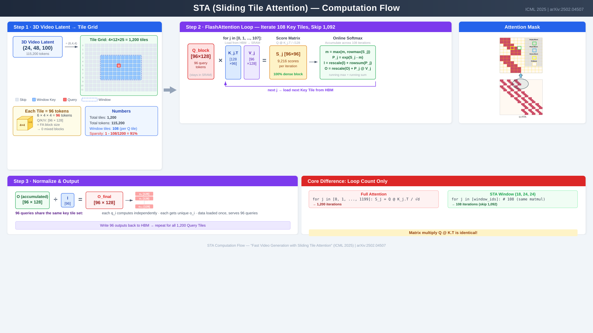

# Attention Variants in Multimodal Diffusion Models: Acceleration Principles and Hardware Implications

> **Version**: v1.0 | **Date**: 2026-03-03
> **Audience**: Technical Management
> **Purpose**: Survey attention acceleration techniques in video/image diffusion models; inform custom operator development planning

---

## Table of Contents

1. [Background: Full Attention Performance Bottleneck](#1-background-full-attention-performance-bottleneck)
2. [Attention Variant Taxonomy & SGLang Support Status](#2-attention-variant-taxonomy--sglang-support-status)
3. [Deep Dive: Sliding Tile Attention (STA)](#3-deep-dive-sliding-tile-attention-sta)
4. [Deep Dive: SegAttention](#4-deep-dive-segattention) *(TBD)*
5. [Future Analysis](#5-future-analysis) *(TBD)*

---

## 1. Background: Full Attention Performance Bottleneck

### 1.1 Why Attention Matters in Diffusion Transformers

Modern video generation models (HunyuanVideo, Wan2.x, CogVideoX) use **Diffusion Transformers (DiT)** as their backbone. Unlike image models, video DiTs process extremely long sequences — a 5-second 720P video produces **115,200 tokens** in the latent space. Since standard attention has **O(N²)** complexity, the cost becomes dominant at these sequence lengths.

```
                    Attention Cost Growth vs. Other Operations

  Time ▲
       │                                           ╱  Attention O(N²)
       │                                         ╱
       │                                       ╱
       │                                     ╱
       │                                  ╱
       │                               ╱
       │                           ╱
       │                       ╱
       │                  ╱           ─────────── Linear layers O(N)
       │             ╱       ─────────
       │         ╱  ────────
       │     ╱───
       │ ╱──
       └───────────────────────────────────────────────► Sequence Length
             1K    5K    10K   30K   50K   70K  115K

  At 115K tokens (5s 720P video):
  N² = 13.3 Billion Q-K pairs per attention layer
```

### 1.2 Measured Data: Wan2.2 Single-Layer Profiling on AMD MI355X

We profiled a single DiT layer of the **Wan2.2** model on **AMD MI355X**. The results clearly show that Multi-Head Attention (MHA) dominates the computation:

| Component   | Time (us) | Percentage |
|:------------|----------:|-----------:|
| All-to-All  |     2,034 |     10.43% |
| **MHA**     | **12,371**| **63.42%** |
| GEMM (FFN)  |     3,641 |     18.67% |
| Others      |     1,460 |      7.48% |
| **Total**   | **19,506**| **100.00%**|

```
  Wan2.2 Single DiT Layer Time Breakdown (MI355X)
  ┌──────────────────────────────────────────────────────────────────────┐
  │                                                                      │
  │                                                                      │
  │   ┌─────────────────────────────────────────────┐                    │
  │   │                                             │                    │
  │   │               MHA (63.42%)                  │                    │
  │   │                                             │                    │
  │   │            12,371 us                        │                    │
  │   │                                             │                    │
  │   └─────────────────────────────────────────────┘                    │
  │                                                                      │
  │   ┌──────────────────┐  ┌────────┐  ┌──────┐                        │
  │   │   GEMM (18.67%)  │  │All2All │  │Others│                        │
  │   │   3,641 us       │  │10.43%  │  │7.48% │                        │
  │   └──────────────────┘  └────────┘  └──────┘                        │
  │                                                                      │
  └──────────────────────────────────────────────────────────────────────┘
```

**Conclusion**: MHA accounts for **63%** of single-layer time. With 30+ transformer layers in a typical DiT, attention is by far the largest optimization target.

### 1.3 Published Profiling Data from Research Papers

Multiple independent papers confirm that attention is the dominant bottleneck:

| Source | Model | Hardware | Attention Time | Metric |
|:-------|:------|:---------|:--------------:|:-------|
| **STA** (arXiv:2502.04507) | HunyuanVideo (5s 720P) | H100 | **84.7%** (800/945s) | Wall-clock |
| **Sparse VideoGen** (arXiv:2502.01776) | HunyuanVideo (5s) | A100 | **>80%** | Wall-clock |
| **Analysis of Attention in VDiTs** (arXiv:2504.10317) | Mochi-1 (10B) | — | **~60%** | FLOPS proportion |
| **Our measurement** | Wan2.2 | MI355X | **63.42%** | Wall-clock (single layer) |

> **Note**: The STA paper reports that generating a 5-second 720P video with HunyuanVideo takes **945 seconds** on a single H100, of which **800 seconds** are spent on attention alone. The Mochi-1 model shows lower attention percentage (~60%) because it uses an Asymmetric DiT architecture with relatively larger FFN layers.

```
  Attention Time Percentage Across Models & Hardware

  100% ┬─────────────────────────────────────────────
       │
   90% ┤
       │   ████
   80% ┤   ████   ████
       │   ████   ████
   70% ┤   ████   ████
       │   ████   ████         ████
   60% ┤   ████   ████         ████   ████
       │   ████   ████         ████   ████
   50% ┤   ████   ████         ████   ████
       │   ████   ████         ████   ████
   40% ┤   ████   ████         ████   ████
       │   ████   ████         ████   ████
   30% ┤   ████   ████         ████   ████
       │   ████   ████         ████   ████
   20% ┤   ████   ████         ████   ████
       │   ████   ████         ████   ████
   10% ┤   ████   ████         ████   ████
       │   ████   ████         ████   ████
    0% ┴───████───████─────────████───████────────────
       HunyuanVideo HunyuanVideo  Wan2.2  Mochi-1
         (H100)      (A100)    (MI355X)
         84.7%       >80%      63.4%     ~60%

  Sources: STA paper, Sparse VideoGen, Our data, Analysis of Attention in VDiTs
```

### 1.4 Key Takeaway

Across different models and hardware platforms, **attention consistently accounts for 60–85% of inference time** in video DiT models. This makes attention the single most impactful optimization target. Any reduction in attention computation — through sparsity, quantization, or algorithmic reformulation — translates almost directly to end-to-end speedup.

---

## 2. Attention Variant Taxonomy & SGLang Support Status

### 2.1 Why So Many Attention Variants?

Full attention computes **all** N² query-key interactions, but in video diffusion models, most of these interactions contribute negligibly to the output. Different acceleration strategies exploit this redundancy in different ways:

```
  Full Attention                    Accelerated Attention (various strategies)
  ──────────────                    ─────────────────────────────────────────

  ┌───────────────────┐             Strategy 1: SKIP unnecessary computations
  │█████████████████│             ┌───────────────────┐
  │█████████████████│             │███░░░░░░░░░░░░░░│  Spatial Sparsity
  │█████████████████│             │░░░███░░░░░░░░░░░│  (STA, VSA)
  │█████████████████│             │░░░░░░███░░░░░░░░│
  │█████████████████│             └───────────────────┘
  │█████████████████│
  │█████████████████│             Strategy 2: CHEAPER computations
  │█████████████████│             ┌───────────────────┐
  └───────────────────┘             │▒▒▒▒▒▒▒▒▒▒▒▒▒▒▒▒▒│  Quantization
  Compute ALL N² pairs              │▒▒▒▒▒▒▒▒▒▒▒▒▒▒▒▒▒│  (SageAttention)
  FP16 precision                    └───────────────────┘  INT8 Q/K, FP16 P·V

  █ = FP16 dense computation                          Strategy 3: REPLACE the algorithm
  ░ = skipped (zero cost)           ┌───────────────────┐
  ▒ = INT8 computation (cheaper)    │ Linear(Q)·Linear(K)│  Linear Attention
                                    └───────────────────┘  (SLA) — O(N) instead of O(N²)
```

### 2.2 Classification of Attention Acceleration Approaches

We categorize the attention variants in SGLang into **four families** based on their acceleration strategy:

```
  ┌─────────────────────────────────────────────────────────────────────┐
  │              Attention Acceleration Taxonomy                        │
  ├─────────────────────┬───────────────────────────────────────────────┤
  │                     │                                               │
  │  ┌───────────────┐  │  ┌───────────────┐                           │
  │  │ Quantization  │  │  │   Spatial     │                           │
  │  │   -based      │  │  │   Sparsity   │                           │
  │  │               │  │  │               │                           │
  │  │ SageAttention │  │  │ STA           │                           │
  │  │ SageAttn 3    │  │  │ VSA           │                           │
  │  │               │  │  │ VMoBA         │                           │
  │  │ Principle:    │  │  │               │                           │
  │  │ Same N² ops,  │  │  │ Principle:    │                           │
  │  │ cheaper each  │  │  │ Skip most     │                           │
  │  │ (INT8 Q@K)    │  │  │ Q-K pairs     │                           │
  │  └───────┬───────┘  │  └───────┬───────┘                           │
  │          │          │          │                                    │
  │          ▼          │          ▼                                    │
  │  ┌───────────────┐  │  ┌───────────────┐                           │
  │  │   Hybrid      │  │  │   Linear      │                           │
  │  │               │  │  │   Attention   │                           │
  │  │ SageSLA       │  │  │               │                           │
  │  │ SpargeAttn    │  │  │ SLA           │                           │
  │  │               │  │  │               │                           │
  │  │ Principle:    │  │  │ Principle:    │                           │
  │  │ Combine       │  │  │ Replace       │                           │
  │  │ quantization  │  │  │ softmax with  │                           │
  │  │ + sparsity    │  │  │ linear kernel │                           │
  │  │ for 2x gains  │  │  │ O(N) cost     │                           │
  │  └───────────────┘  │  └───────────────┘                           │
  │                     │                                               │
  └─────────────────────┴───────────────────────────────────────────────┘
```

#### Category 1: Quantization-Based

**Representative**: SageAttention (v1/v2/v3)

- **How it accelerates**: Quantize Q and K to INT8 before computing Q@K^T. The score matrix computation uses INT8 tensor cores (2x throughput vs FP16). P@V remains in FP16 for accuracy.
- **Speedup**: ~2x over FlashAttention with negligible quality loss
- **Trade-off**: Same number of operations, but each operation is cheaper

#### Category 2: Spatial Sparsity

**Representatives**: STA, VSA, VMoBA

- **How it accelerates**: Identify which Q-K pairs are important (based on spatial locality, learned patterns, or dynamic selection), and skip the rest entirely.
- **Speedup**: Proportional to sparsity — 90% sparsity ≈ ~10x fewer operations
- **Trade-off**: Some attention information is discarded; requires careful window/mask design

#### Category 3: Linear Attention

**Representative**: SLA (Sparse Linear Attention)

- **How it accelerates**: Replace the softmax attention mechanism with a linear kernel function, reducing complexity from O(N²) to O(N). This fundamentally changes the computation rather than optimizing it.
- **Speedup**: Theoretically unbounded as N grows; in practice 5-20x on long sequences
- **Trade-off**: Requires model fine-tuning; may affect generation quality

#### Category 4: Hybrid Approaches

**Representatives**: SageSLA, SpargeAttention

- **How it accelerates**: Combine techniques from multiple categories. For example, SageSLA combines SageAttention's quantization with SLA's linear formulation; SpargeAttention combines SageAttention with spatial sparsity.
- **Speedup**: Multiplicative gains from combining techniques
- **Trade-off**: More complex implementation; cumulative accuracy impact

### 2.3 SGLang Compatibility Matrix

The table below shows which attention optimizations are supported for each model in **SGLang's diffusion pipeline**:

| Model Name | Model ID | TeaCache | Sliding Tile Attn | Sage Attn | VSA | SLA | SageSLA | SVG2 |
|:---|:---|:---:|:---:|:---:|:---:|:---:|:---:|:---:|
| FastWan2.1 T2V 1.3B | `FastVideo/FastWan2.1-T2V-1.3B-Diffusers` | — | — | — | ✅ | ❌ | ❌ | ❌ |
| FastWan2.2 TI2V 5B Full Attn | `FastVideo/FastWan2.2-TI2V-5B-FullAttn-Diffusers` | — | — | — | ✅ | ❌ | ❌ | ❌ |
| Wan2.2 TI2V 5B | `Wan-AI/Wan2.2-TI2V-5B-Diffusers` | — | — | ✅ | — | ❌ | ❌ | ❌ |
| Wan2.2 T2V A14B | `Wan-AI/Wan2.2-T2V-A14B-Diffusers` | ❌ | ❌ | ✅ | — | ❌ | ❌ | ❌ |
| Wan2.2 I2V A14B | `Wan-AI/Wan2.2-I2V-A14B-Diffusers` | ❌ | ❌ | ✅ | — | ❌ | ❌ | ❌ |
| HunyuanVideo | `hunyuanvideo-community/HunyuanVideo` | ❌ | ✅ | ✅ | — | ❌ | ❌ | ✅ |
| FastHunyuan | `FastVideo/FastHunyuan-diffusers` | ❌ | ✅ | ✅ | — | ❌ | ❌ | ✅ |
| Wan2.1 T2V 1.3B | `Wan-AI/Wan2.1-T2V-1.3B-Diffusers` | ✅ | ✅ | ✅ | — | ❌ | ❌ | ✅ |
| Wan2.1 T2V 14B | `Wan-AI/Wan2.1-T2V-14B-Diffusers` | ✅ | ✅ | ✅ | — | ❌ | ❌ | ✅ |
| Wan2.1 I2V 480P | `Wan-AI/Wan2.1-I2V-14B-480P-Diffusers` | ✅ | ✅ | ✅ | — | ❌ | ❌ | ✅ |
| Wan2.1 I2V 720P | `Wan-AI/Wan2.1-I2V-14B-720P-Diffusers` | ✅ | ✅ | ✅ | — | ❌ | ❌ | ✅ |
| TurboWan2.1 T2V 1.3B | `IPostYellow/TurboWan2.1-T2V-1.3B-Diffusers` | ✅ | ❌ | ❌ | ❌ | ✅ | ✅ | — |
| TurboWan2.1 T2V 14B | `IPostYellow/TurboWan2.1-T2V-14B-Diffusers` | ✅ | ❌ | ❌ | ❌ | ✅ | ✅ | — |
| TurboWan2.1 T2V 14B 720P | `IPostYellow/TurboWan2.1-T2V-14B-720P-Diffusers` | ✅ | ❌ | ❌ | ❌ | ✅ | ✅ | — |
| TurboWan2.2 I2V A14B | `IPostYellow/TurboWan2.2-I2V-A14B-Diffusers` | ✅ | ❌ | ❌ | ❌ | ✅ | ✅ | — |

> Source: SGLang Diffusion `docs/diffusion/compatibility_matrix.md`

### 2.4 Key Observation

The compatibility matrix reveals an important pattern: **no single acceleration technique works for all models**. This is because:

1. **Model architecture differences** — Some models (Wan2.2 A14B) use attention patterns incompatible with STA's tiling
2. **Training requirements** — Linear attention (SLA) requires specialized distilled models (TurboWan series)
3. **Hardware constraints** — STA's CUDA kernel requires Hopper GPUs; the Triton kernel is cross-platform

This diversity reinforces the need for hardware-level support of multiple attention paradigms, not just one.

---

## 3. Deep Dive: Sliding Tile Attention (STA)

> **Paper**: "Fast Video Generation with Sliding Tile Attention" (Zhang et al., 2025, arXiv:2502.04507)
> **Code**: [hao-ai-lab/FastVideo](https://github.com/hao-ai-lab/FastVideo)

### 3.1 Core Insight: Why STA Can Accelerate Attention

STA is built on a single fundamental observation: **in video diffusion models, attention scores concentrate locally in 3D space**.

```
  Attention Score Distribution in Video DiT (HunyuanVideo)
  ─────────────────────────────────────────────────────────

  For a query token at position (t, h, w):

  High attention ███     Low attention ░░░     Near-zero ···

                 Time (t) ───────────────────►
                ┌─────────────────────────────────────┐
               ╱│░░░░░░░░░░░░░░░░░░░░░░░░░░░░░░░░░░░│
     Height   ╱ │░░░░░░░░░░░░░░░░░░░░░░░░░░░░░░░░░░░│
     (h)     ╱  │░░░░░░░░░███████████░░░░░░░░░░░░░░░│
            ╱   │░░░░░░░░░███████████░░░░░░░░░░░░░░░│
           ╱    │░░░░░░░░░███████████░░░░░░░░░░░░░░░│
          ╱     │░░░░░░░░░░░░░░░░░░░░░░░░░░░░░░░░░░░│
         ╱      │░░░░░░░░░░░░░░░░░░░░░░░░░░░░░░░░░░░│
        ┌───────│─────────────────────────────────────│
        │       │                                     │
        └───────│─────────────────────────────────────┘
                Width (w) ───────────────────►

  > 90% of attention mass falls within a local 3D window
  (Paper Figure 2-3: tested across 10 diverse prompts, pattern is prompt-agnostic)
```

This means we can **skip computing attention for distant tokens** with minimal quality loss. The question is: **how to skip efficiently on GPU hardware?**

### 3.2 The Problem with Naive Sliding Window Attention

A naive approach (like NATTEN/CLEAR) applies a sliding window at the **token level** — each token has its own window center. But FlashAttention computes at the **block level** (groups of tokens). This mismatch creates three types of blocks:

```
  Token-Level Sliding Window (NATTEN)     Tile-Level Sliding Window (STA)
  ────────────────────────────────────     ──────────────────────────────

  ┌───┬───┬───┬───┬───┬───┐              ┌───┬───┬───┬───┬───┬───┐
  │ D │ M │   │   │   │   │              │ D │ D │ D │   │   │   │
  ├───┼───┼───┼───┼───┼───┤              ├───┼───┼───┼───┼───┼───┤
  │ M │ D │ M │   │   │   │              │ D │ D │ D │ D │   │   │
  ├───┼───┼───┼───┼───┼───┤              ├───┼───┼───┼───┼───┼───┤
  │   │ M │ D │ M │   │   │              │   │ D │ D │ D │ D │   │
  ├───┼───┼───┼───┼───┼───┤              ├───┼───┼───┼───┼───┼───┤
  │   │   │ M │ D │ M │   │              │   │   │ D │ D │ D │ D │
  └───┴───┴───┴───┴───┴───┘              └───┴───┴───┴───┴───┴───┘

  D = Dense block (efficient)              D = Dense block (efficient)
  M = Mixed block (INEFFICIENT)            No mixed blocks!
      Same cost as Dense + mask overhead

  Result at 90% sparsity:                 Result at 90% sparsity:
  CLEAR achieves 0.86x (SLOWER!)          STA achieves 10.45x speedup
```

**Why mixed blocks kill performance**: A mixed block has some tokens inside the window and some outside. The GPU must still compute the full block (same FLOPs as dense) and then apply a mask. This means **mixed blocks cost MORE than dense blocks** — they pay full compute plus mask overhead.

**STA's solution**: Group tokens into **tiles** first, then apply the sliding window at the **tile level**. All tokens in the same tile share the same window center, so every block is either fully inside (dense) or fully outside (empty). **Zero mixed blocks**.

### 3.3 STA Computation Flow

The following diagram illustrates the complete STA computation pipeline using HunyuanVideo 720P 5s as a concrete example:



#### Step 1: 3D Video Latent → Tile Grid

```
  Input: 3D Video Latent

  ┌────────────────────────────────────────┐
  │                                        │
  │     30 × 48 × 80 = 115,200 tokens     │    ÷ tile size (6, 8, 8)
  │     (Time × Height × Width)            │    ─────────────────────►
  │                                        │
  └────────────────────────────────────────┘

                                    Tile Grid: 5 × 6 × 10 = 300 tiles

                                    ┌────────────────────────────────┐
                                    │  Each tile = 6 × 8 × 8        │
                                    │            = 384 tokens        │
                                    │                                │
                                    │  Q/K/V block: [384 × 128]     │
                                    │                                │
                                    │  Tile boundary = FA block      │
                                    │  boundary → 0 mixed blocks     │
                                    └────────────────────────────────┘

  Key property: tokens within the same tile get consecutive IDs
  (via einops rearrange), so each tile maps to exactly one
  FlashAttention block.
```

#### Step 2: Determine Window Key Tiles per Query Tile

For each Query Tile, determine which Key Tiles are within the 3D sliding window:

```
  Example: Tile Grid 5 × 6 × 10, Window = (3, 3, 3) tiles

  Query Tile at position (2, 3, 5):
    T-window: [1, 2, 3]     → 3 tiles
    H-window: [2, 3, 4]     → 3 tiles
    W-window: [4, 5, 6]     → 3 tiles
    Window tiles: 3 × 3 × 3 = 27 tiles

  ┌─────────────────────────────────────────────────────────────────┐
  │                    Tile Grid (viewed from T axis)                │
  │                                                                  │
  │    ░░░░░░░░░░░░░░░░░░░░░░░░░░░░░░░░░░░░░░░░░░░░░░░░░░         │
  │    ░░░░░░░░░░░░░░░░░░░░░░░░░░░░░░░░░░░░░░░░░░░░░░░░░░         │
  │    ░░░░░░░░░░░░░░░░░░░░░░░░░░░░░░░░░░░░░░░░░░░░░░░░░░         │
  │    ░░░░░░░░░░░░░░█████████████░░░░░░░░░░░░░░░░░░░░░░░░         │
  │    ░░░░░░░░░░░░░░█████████████░░░░░░░░░░░░░░░░░░░░░░░░         │
  │    ░░░░░░░░░░░░░░████ Q ██████░░░░░░░░░░░░░░░░░░░░░░░░         │
  │    ░░░░░░░░░░░░░░█████████████░░░░░░░░░░░░░░░░░░░░░░░░         │
  │    ░░░░░░░░░░░░░░░░░░░░░░░░░░░░░░░░░░░░░░░░░░░░░░░░░░         │
  │    ░░░░░░░░░░░░░░░░░░░░░░░░░░░░░░░░░░░░░░░░░░░░░░░░░░         │
  │                                                                  │
  │    ░ = Skip (273 tiles)    █ = Window key tiles (27 tiles)       │
  │    Q = Query tile          Sparsity = 1 - 27/300 = 91%          │
  └─────────────────────────────────────────────────────────────────┘
```

#### Step 3: FlashAttention Loop — Iterate Only Window Tiles

```
  ┌──────────────────────────────────────────────────────────────────────────┐
  │  Q_block [384×128] loaded into SRAM (stays for all iterations)           │
  │                                                                          │
  │  for j in [0, 1, ..., 26]:    ◄── only 27 iterations (not 300!)        │
  │  ┌────────────────────────────────────────────────────────────────────┐  │
  │  │                                                                    │  │
  │  │  ① Load K_j [384×128] and V_j [384×128] from HBM → SRAM          │  │
  │  │                                                                    │  │
  │  │  ② Score: S_j = Q_block @ K_j.T / √128                           │  │
  │  │     [384×128] @ [128×384] = S_j [384×384]                         │  │
  │  │     → 147,456 scores per iteration                                │  │
  │  │     → 100% dense block (no masking needed!)                       │  │
  │  │                                                                    │  │
  │  │  ③ Online Softmax (incremental, no full P matrix):                │  │
  │  │     m = max(m, rowmax(S_j))                                       │  │
  │  │     P_j = exp(S_j - m)                                           │  │
  │  │     l = rescale(l) + rowsum(P_j)                                  │  │
  │  │                                                                    │  │
  │  │  ④ Accumulate: O = rescale(O) + P_j @ V_j                        │  │
  │  │     [384×384] @ [384×128] → O [384×128]                           │  │
  │  │                                                                    │  │
  │  └───────────────────────────────────────┬────────────────────────────┘  │
  │                                          │                               │
  │                   next j ◄───────────────┘                               │
  │                                                                          │
  │  After loop: O_final = O / l    → 384 output vectors [384×128]          │
  │  Write O_final back to HBM → Repeat for all 300 Query Tiles             │
  └──────────────────────────────────────────────────────────────────────────┘
```

#### The Core Difference: Loop Count Only

```
  ┌──────────────────────────────────┐    ┌──────────────────────────────────┐
  │         Full Attention            │    │       STA (91% sparsity)         │
  │                                   │    │                                  │
  │  for j in [0, 1, ..., 299]:      │    │  for j in [window_ids]:  # 27   │
  │      S_j = Q @ K_j.T / √d       │    │      S_j = Q @ K_j.T / √d      │
  │                                   │    │                                  │
  │  → 300 iterations                │    │  → 27 iterations                │
  │  → 300 × 147,456 = 44.2M scores │    │  → 27 × 147,456 = 4.0M scores  │
  │                                   │    │                                  │
  │  The per-iteration matmul is     │    │  ← IDENTICAL matmul             │
  │  EXACTLY THE SAME                │    │  Just fewer iterations           │
  └──────────────────────────────────┘    └──────────────────────────────────┘

  Speedup source: purely from reducing iteration count
  No algorithm change, no approximation in the matmul itself
```

### 3.4 Paper Benchmark Data

#### Speedup Comparison (from STA paper)

| Method | Sparsity | VBench Total | Quality | Speedup | Notes |
|:-------|:--------:|:------------:|:-------:|:-------:|:------|
| HunyuanVideo (FA3) | 0% | 82.71% | 85.34% | 1.0x | Baseline |
| CLEAR (r=32) | ~90% | 82.37% | 84.41% | **0.37x** (slower!) | Mixed blocks kill perf |
| Tiled NATTEN (w=30,41,41) | ~90% | 82.69% | 84.61% | **0.51x** (slower!) | Mixed blocks |
| STA training-free | — | 82.46% | 84.63% | 1.79x | No fine-tuning needed |
| **STA finetuned** | — | **83.00%** | **85.37%** | **2.44x** | Improves quality! |
| **STA finetuned** | ~91% | **82.62%** | **84.76%** | **3.53x** | Only -0.09% VBench |

> Key result: At 91% sparsity, STA achieves **3.53x end-to-end speedup** with only 0.09% quality degradation. Competing methods (CLEAR, NATTEN) are actually **slower than full attention** at the same sparsity level due to mixed block overhead.

#### Block Pattern Comparison (Paper Table 1)

| Window Size (3D) | Method | Dense Block % | Mixed Block % |
|:---:|:---:|:---:|:---:|
| (11,11,11) | Tiled NATTEN | 0.06% | **7.17%** |
| (12,12,12) | **STA** | 1.56% | **0.0%** |
| (20,20,20) | **STA** | 7.23% | **0.0%** |

> STA's guarantee of **zero mixed blocks** is the fundamental reason for its GPU efficiency advantage.

#### Quality Preservation (Human Evaluation, Paper Data)

```
  STA-finetuned (2.43x speedup) vs Baseline HunyuanVideo:

  Evaluators could not distinguish STA output from original in 83% of cases:

  STA Win:   ██████                                6.5%
  Tie:       ████████████████████████████████████  83.0%    ◄── near-indistinguishable
  Orig Win:  ████████████                          10.5%
```

### 3.5 Measured Benchmark Data: B200 (Blackwell)

#### Test Environment

| Item | Detail |
|:-----|:-------|
| **GPU** | NVIDIA B200 (Blackwell, SM 10.0, 148 SMs) |
| **Memory** | 178.35 GB HBM3e |
| **CUDA** | 12.9 |
| **Precision** | BF16 |
| **Backends** | STA Triton, FA4, SDPA |

> **Note**: The STA CUDA kernel (based on ThunderKittens/WGMMA) is **ISA-incompatible with Blackwell** — Hopper's WGMMA instructions were removed in SM 100 and replaced with TCGEN05. Only the Triton kernel works on B200.

#### Latency & Speedup (B200)

| Shape | Method | Window | Latency (ms) | Speedup | Sparsity |
|:------|:-------|:-------|:------------:|:-------:|:--------:|
| **HunyuanVideo** (30×48×80) | SDPA | full | 119.06 | 1.00x | — |
| | FA4 | full | 122.74 | ~1.0x | — |
| | STA Triton | (3,3,3) | **46.40** | **2.57x** | 91% |
| | STA Triton | (3,6,1) | **35.05** | **3.40x** | 94% |
| **StepVideo** (36×48×48) | SDPA | full | 61.63 | 1.00x | — |
| | FA4 | full | 63.96 | ~1.0x | — |
| | STA Triton | (3,3,3) | **24.01** | **2.57x** | 88% |
| | STA Triton | (3,1,6) | **16.10** | **3.83x** | 92% |
| **Wan 480P** (18×48×80) | SDPA | full | 42.45 | 1.00x | — |
| | FA4 | full | 44.43 | ~1.0x | — |
| | STA Triton | (3,3,3) | **16.61** | **2.56x** | 85% |
| | STA Triton | (3,6,1) | **11.25** | **3.77x** | 90% |

```
  B200 Speedup: STA Triton Sparse vs SDPA Baseline

  Speedup
  4.0x ┤
       │                                              ████
  3.5x ┤              ████                            ████
       │              ████              ████          ████
  3.0x ┤              ████              ████          ████
       │              ████              ████          ████
  2.5x ┤  ████        ████  ████        ████  ████    ████
       │  ████        ████  ████        ████  ████    ████
  2.0x ┤  ████        ████  ████        ████  ████    ████
       │  ████        ████  ████        ████  ████    ████
  1.5x ┤  ████        ████  ████        ████  ████    ████
       │  ████  ────  ████  ████  ────  ████  ████    ████
  1.0x ┤──████──SDPA──████──████──SDPA──████──████────████──
       │  ████        ████  ████        ████  ████    ████
  0.5x ┤
       │
  0.0x ┴──────────────────────────────────────────────────────
       HunyuanVideo (3,3,3)  StepVideo (3,3,3)   Wan (3,3,3)
                     (3,6,1)            (3,1,6)        (3,6,1)

  ──── = SDPA baseline (1.0x)
```

### 3.6 Measured Benchmark Data: H20 (Hopper)

#### Test Environment

| Item | Detail |
|:-----|:-------|
| **GPU** | NVIDIA H20 (Hopper, SM 9.0, 78 SMs) |
| **Memory** | 95.08 GB HBM3 |
| **CUDA** | 12.9 |
| **Precision** | BF16 |
| **Backends** | STA CUDA, STA Triton, FA3, SDPA |

> **Key**: H20 is SM 9.0 (same as H100), so the native STA CUDA kernel works. This enables direct comparison between the optimized CUDA kernel and the cross-platform Triton kernel.

#### Latency & Speedup (H20)

| Shape | Method | Window | Latency (ms) | Speedup | Sparsity |
|:------|:-------|:-------|:------------:|:-------:|:--------:|
| **HunyuanVideo** (30×48×80) | SDPA | full | 1,156.9 | 1.00x | — |
| | FA3 | full | 1,163.4 | 0.99x | — |
| | STA CUDA | (3,3,3) | **131.3** | **8.81x** | 91% |
| | STA Triton | (3,3,3) | 130.3 | 8.88x | 91% |
| | STA Triton | (3,6,1) | **93.6** | **12.36x** | 94% |
| **StepVideo** (36×48×48) | SDPA | full | 595.3 | 1.00x | — |
| | FA3 | full | 603.5 | 0.99x | — |
| | STA CUDA | (3,3,3) | **82.2** | **7.24x** | 88% |
| | STA Triton | (3,3,3) | 90.1 | 6.61x | 88% |
| | STA Triton | (3,6,1) | **60.1** | **9.90x** | 92% |
| **Wan 480P** (18×48×80) | SDPA | full | 413.9 | 1.00x | — |
| | FA3 | full | 419.9 | 0.99x | — |
| | STA CUDA | (3,3,3) | 67.9 | 6.10x | 85% |
| | STA CUDA | (3,6,1) | **45.1** | **9.18x** | 90% |
| | STA Triton | (3,6,1) | **47.6** | **8.70x** | 90% |

```
  H20 Speedup: STA CUDA vs STA Triton vs SDPA Baseline

  Speedup
  13x ┤
  12x ┤  ▓▓▓▓
  11x ┤  ▓▓▓▓
  10x ┤  ▓▓▓▓              ▓▓▓▓
   9x ┤  ▓▓▓▓  ████        ▓▓▓▓              ████
   8x ┤  ▓▓▓▓  ████        ▓▓▓▓        ████  ████
   7x ┤  ▓▓▓▓  ████        ▓▓▓▓  ████  ████  ████
   6x ┤  ▓▓▓▓  ████        ▓▓▓▓  ████  ████  ████  ████
   5x ┤  ▓▓▓▓  ████        ▓▓▓▓  ████  ████  ████  ████
   4x ┤  ▓▓▓▓  ████        ▓▓▓▓  ████  ████  ████  ████
   3x ┤  ▓▓▓▓  ████        ▓▓▓▓  ████  ████  ████  ████
   2x ┤  ▓▓▓▓  ████        ▓▓▓▓  ████  ████  ████  ████
   1x ┤──▓▓▓▓──████──SDPA──▓▓▓▓──████──SDPA──████──████──SDPA──
   0x ┴──────────────────────────────────────────────────────────
      HunyuanVideo           StepVideo             Wan 480P
      Triton CUDA            Triton CUDA         CUDA  Triton
      (3,6,1)(3,3,3)         (3,6,1)(3,3,3)      (3,6,1)(3,6,1)

  ████ = STA CUDA    ▓▓▓▓ = STA Triton    ── = SDPA baseline
```

### 3.7 STA Correctness Verification

STA with **full window** (equivalent to full attention, just reordered) produces numerically identical results:

| Platform | Shape | L2 Relative Error | Cosine Similarity | Status |
|:---------|:------|:-----------------:|:-----------------:|:------:|
| B200 | HunyuanVideo (30×48×80) | 0.003123 | 0.999995 | PASS |
| B200 | StepVideo (36×48×48) | 0.003183 | 0.999995 | PASS |
| B200 | Wan 480P (18×48×80) | 0.003084 | 0.999995 | PASS |
| H20 (CUDA) | HunyuanVideo (30×48×80) | 0.000251 | 1.000000 | PASS |
| H20 (CUDA) | StepVideo (36×48×48) | 0.000218 | 1.000000 | PASS |
| H20 (CUDA) | Wan 480P (18×48×80) | 0.000200 | 1.000000 | PASS |

> The tiny error (L2 < 0.004) is from BF16 floating-point rounding in different computation ordering. The CUDA kernel achieves ~10x tighter error than Triton due to optimized memory access patterns.

### 3.8 Cross-Platform Comparison Summary

```
                        SDPA Baseline            STA Sparse (3,3,3)
  Platform          Latency    TFLOPS         Speedup    Kernel
  ─────────────────────────────────────────────────────────────────
  B200 (Blackwell)   119 ms     1,376          2.57x     Triton
  H20  (Hopper)    1,157 ms       142          8.81x     CUDA
  MI300X (AMD)     2,414 ms        68         10.07x     Triton
  ─────────────────────────────────────────────────────────────────

  Key insight: STA speedup ratios are HIGHER on platforms where SDPA is slower.
  The CUDA kernel on H20 achieves the best balance of efficiency + speedup.

  H100 data: TBD (testing in progress, will be updated)
```

### 3.9 Hardware Implications for Custom Operator Development

From the STA analysis, key takeaways for hardware operator design:

1. **Tile-aligned computation is critical** — the core reason STA outperforms NATTEN/CLEAR is that tile boundaries align with FlashAttention block boundaries, producing zero mixed blocks. Custom operators should support configurable tile/block sizes.

2. **The matmul itself is unchanged** — STA does not modify the Q@K^T or P@V computation. The speedup comes purely from the scheduler (which tiles to compute). This means the same matmul kernel can serve both full and sparse attention.

3. **Cross-platform Triton vs native CUDA** — On H20, the native CUDA kernel is only 5-15% faster than Triton for STA. The bigger gap is in full-attention mode (CUDA 0.93x SDPA vs Triton 0.83x SDPA). For sparse attention, the tile-skip scheduling matters more than low-level kernel optimization.

4. **ISA portability matters** — The STA CUDA kernel uses Hopper WGMMA instructions that were **removed** in Blackwell (replaced by TCGEN05). A production operator must abstract the MMA instruction layer to support multiple GPU architectures.

---

## 4. Deep Dive: SegAttention

> *This section is under preparation by a colleague and will be added in a future update.*

---

## 5. Future Analysis

> *Additional attention variants (SageAttention, VSA, SLA, etc.) will be analyzed following the same structure as Chapter 3:*
> - *Acceleration principle*
> - *Paper benchmark data*
> - *Measured benchmark data*
> - *Hardware implications*

---

## References

| # | Paper | ArXiv | Venue |
|---|:------|:------|:------|
| 1 | Fast Video Generation with Sliding Tile Attention (STA) | [2502.04507](https://arxiv.org/abs/2502.04507) | ICML 2025 |
| 2 | Accelerating Video Diffusion Transformers (Sparse VideoGen) | [2502.01776](https://arxiv.org/abs/2502.01776) | ICML 2025 |
| 3 | Analysis of Attention in Video Diffusion Transformers | [2504.10317](https://arxiv.org/abs/2504.10317) | — |
| 4 | SageAttention: Accurate 8-Bit Attention | [2410.02367](https://arxiv.org/abs/2410.02367) | ICLR 2025 |
| 5 | FlashAttention: Fast and Memory-Efficient Exact Attention | [2205.14135](https://arxiv.org/abs/2205.14135) | NeurIPS 2022 |
| 6 | FlashAttention-2: Faster Attention with Better Parallelism | [2307.08691](https://arxiv.org/abs/2307.08691) | ICLR 2024 |
| 7 | SpargeAttention: Accurate Sparse Attention Accelerating | [2502.18137](https://arxiv.org/abs/2502.18137) | ICML 2025 |
| 8 | Video Sparse Attention (VSA) | [2505.13389](https://arxiv.org/abs/2505.13389) | — |
| 9 | Sparse Linear Attention (SLA) | [2509.24006](https://arxiv.org/abs/2509.24006) | — |
